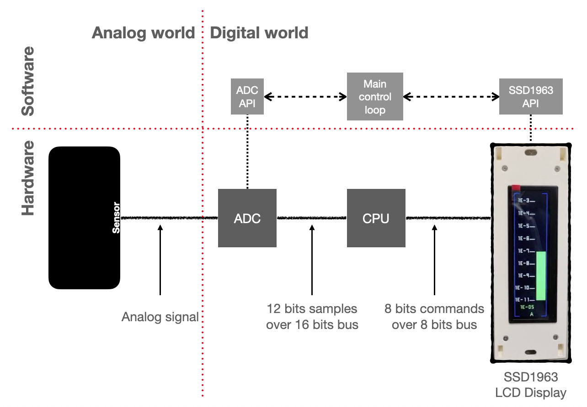
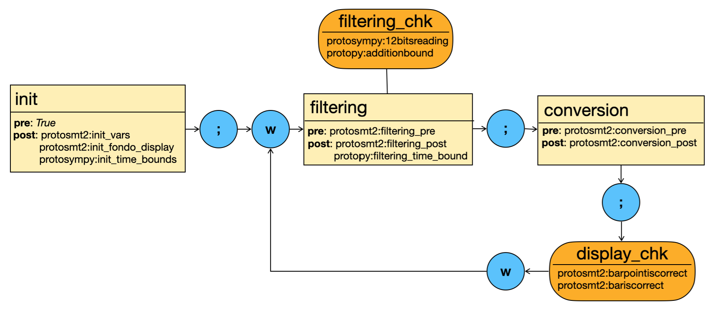
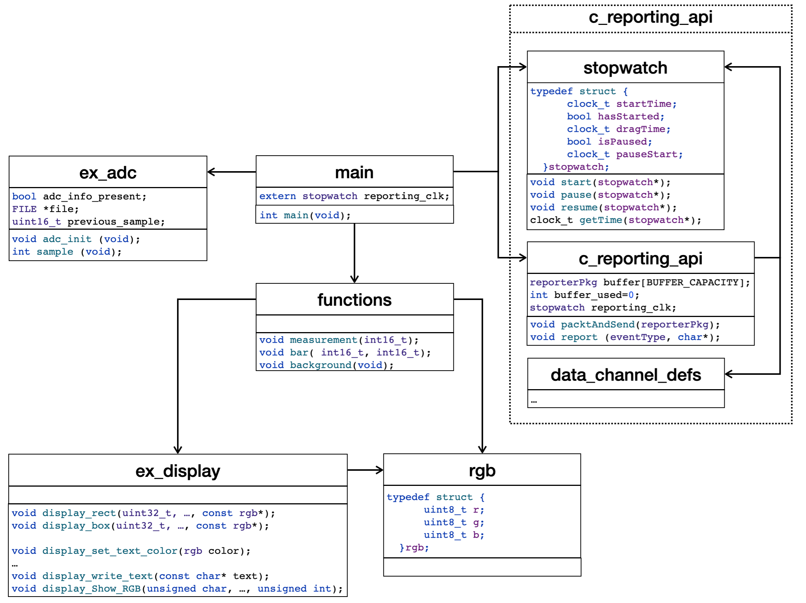

# Example application written in C for the Runtime Monitor
This project provides a simple C application serving as example for the use of the [Runtime Reporter](https://github.com/invap/rt-reporter/ "The Runtime Reporter") and the [Runtime Monitor](https://github.com/invap/rt-monitor/ "The Runtime Monitoring") in the runtime verification of a software system. The application implements the software layer of the hardware-software system shown in [Figure 1](#hardware-software-system).

<figure id="hardware-software-system" style="text-align: center;">
  
  <figcaption style="font-style: italic;"><b>Figure 1</b>: A hardware-software system for displaying the magnitude of an analog signal.
  </figcaption>
</figure>

The rationale of the system is that of a control loop (**Main control loop** in [Figure 1](#hardware-software-system)) that performs the following tasks:
1. reads digital data from an analog-digital converter (*ADC*) (from now on referred to as sample),
2. converts it to a floating point number (from now on, referred to as engineering value), and
3. displays it as a bar in an LCD akin the SSD1963 from Solomon Systech Limited (*LCD*).

The runtime verification attained with the runtime monitor is done at the software layer of the system in order to check the correctness[^correctness] of the software implementation with respect to an abstract specification of the process (see Section [Structured Sequential Processes](https://github.com/invap/rt-monitor/blob/main/README.md#structured-sequential-processes "Structured Sequential Processes") for a detailed presentation of the language for describing structured sequential processes, the abstract language used for specifying software artifacts). 

The ADC and the LCD are operated through high level libraries (**ADC API** and **LCD API** in [Figure 1](#hardware-software-system), respectively, for reference) that are discussed in detail in Section [ADC implementation and operation](#adc-implementation-and-operation) and Section [LCD implementation and operation](#lcd-implementation-and-operation).

The project provides four implementations of the software level of the system (we will describe them in detail in Section [Implementations of the app](#implementations-of-the-app)), all sharing the same rationale and source code structure. Two of them use an implementation of the ADC with self-logging capability, while the other two rely on the main program for logging the ADC behaviour.


## Installation
In this section we will review relevant aspects of how to setup this project for using it as a example application for using the [Runtime Reporter](https://github.com/invap/rt-reporter/ "The Runtime Reporter") and the [Runtime Monitor](https://github.com/invap/rt-monitor/ "The Runtime Monitoring").

The implementation of the example application is distributed as source code to be used as running example. For obtaining it checkout the repository [rt-monitor-example-app](https://github.com/invap/rt-monitor-example-app/ "An example application for the Runtime Monitor")

### Base C language installation
- gcc 11.x to gcc 12, or newer (https://gcc.gnu.org/)
- clang 14.0.0 or newer (Install via [Homebrew](https://brew.sh) with command `brew install gcc`
- MinGW (https://osdn.net/projects/mingw/)

### Structure the project
The example application project is organized as follows:
```graphql
rt-monitor-example-app/
├── buggy app/                        # Example application with a bug in file functions.c
│   ├── functions.c
│   ├── functions.h
│   └── main.c
├── buggy app self-logging/           # Example application with a bug in file functions.c
│   ├── functions.c                   # and resorting to the self-logging implementation
│   ├── functions.h                   # of the data source.
│   └── main.c
├── data-display/                     # Implementation of the stub for the API of the display
│   ├── ex_display.c
│   ├── ex_display.h
│   └── rgb.h
├── data-source/                      # Implementation of the API of the data source
│   ├── ex_adc.c
│   └── ex_adc.h
├── data-source self-logging/         # Implementation of the API of the data source with
│   ├── ex_adc.c                      # self-logging capabilities
│   └── ex_adc.h
├── framework-working-copy/           # Definition of the analysis framework
│   ├── 12bitsreading.protosympy      # │
│   ├── additionbound.protopy         # │
│   ├── bariscorrect.protosmt2        # │ Properties to be checked at different points in the SSP
│   │...                              # │ the SSP
│   ├── init_time_bound               # │
│   └── spec_gr.toml                  # Specification of the SSP
├── patched app/                      # Example application with the bug in file functions.c
│   ├── functions.c                   # fixed and resorting to the self-logging implementation
│   ├── functions.h
│   └── main.c
├── patched app self-logging/         # Example application with the bug in file functions.c
│   ├── functions.c                   # fixed and resorting to the self-logging implementation
│   ├── functions.h                   # of the data source.
│   └── main.c
├── README_images/                    # Images for the read me file
│   ├── class-diagram.png             # Class diagram of the software layer of the system
│   ├── hardware-software-system.png  # Systems design
│   └── ssp-software.png              # SSP diagram
├── COPYING                           # Licence of the project 
├── makefile                          # Make file for building the different versions of the application
└── README.md                         # Read me file of the project
```


## The software layer of the system as a structured sequential process
In this section we formalise the intended behaviour of the software layer of the system shown in [Figure 1](#hardware-software-system). [Figure 2](#ssp-software) provides a graphical depiction of the expected behaviour of the software layer of the hardware-software system shown in Figure 1 as a structured sequential process (SSP).

<figure id="ssp-software" style="text-align: center;">
  
  <figcaption style="font-style: italic;"><b>Figure 2</b>: Specification of the software layer of the hardware-software system shown in Figure 1 as a structured sequential process.
  </figcaption>
</figure>

The intuition behind the SSP shown above is that after an initial task (*init*) that performs the initialization of the process, the artifact enters an infinite loop which performs a filtering task (*filtering*), which has a local checkpoint (*filtering_chk*), that computes a stable sample by taking the average of 16 individual samples, then the process goes through a conversion task (*conversion*) that produces the engineering value corresponding to that sample according to the interpretation of the analog signal being sampled, and, finally, there is a global checkpoint (*display_chk*) for checking the coherence of the data shown in the LCD with respect to the engineering value computed in the task *conversion*.

The specification of the analysis framework must be written in TOML format. For a detailed presentation of the syntax the reader is pointed to Section [Specification language for describing the analysis framework](https://github.com/invap/rt-monitor/blob/main/README.md#specification-language-for-describing-the-analysis-framework "Specification language for describing the analysis framework").

The following fragment shows the structured sequential process of [Figure 2](#ssp-software) in TOML format:
```toml
name = "rt-monitor-example-app"
working_directory = "./sandbox/rt-monitor-example-app self-logging patched/specification/"
[process]
	format = "graph"
	[process.structure]
		nodes = [
			["init", "task"],
			["filtering", "task"],
			["conversion", "task"],
			["display_chk", "checkpoint"],
		]
		edges = [
			["init","filtering"],
			["filtering","conversion"],
			["conversion","display_chk"],
			["display_chk","filtering"]
		]
		start = "init"

[[process.tasks]]
	name = "init"
	[[process.tasks.pres]]
	[[process.tasks.posts]]
		name = "init_vars"
		format = "smt2"
		variables = "(main_realvalue_old:State Int)"
		formula = "(= main_realvalue_old 0)"        # inline formula.
	[[process.tasks.posts]]
		name = "init_fondo_display"
		file = "init_fondo_display.toml"       # local file.
	[[process.tasks.posts]]
		name = "init_time_bound"
		file = "./sandbox/rt-monitor-example-app self-logging patched/specification/init_time_bound.toml"       # relative path to file.

[[process.tasks]]
	name = "filtering"
	[[process.tasks.pres]]
		name = "filtering_pre"
		file = "/Users/clpombo/sandbox/invap-github/rt-monitor/sandbox/rt-monitor-example-app self-logging patched/specification/filtering_pre.toml"       # absolute path to file.
	[[process.tasks.posts]]
		name = "filtering_post"
		file = "filtering_post.toml"       # local file.
	[[process.tasks.posts]]
		name = "filtering_time_bound"
		file = "filtering_time_bound.toml"       # local file.
	[[process.tasks.checkpoints]]
		name = "filtering_chk"
		[[process.tasks.checkpoints.properties]]
			name = "12bitsreading"
			file = "12bitsreading.toml"       # local file.
		[[process.tasks.checkpoints.properties]]
			name = "additionbound"
			file = "additionbound.toml"       # local file.

[[process.tasks]]
	name = "conversion"
	[[process.tasks.pres]]
		name = "conversion_pre"
		file = "conversion_pre.toml"       # local file.
	[[process.tasks.posts]]
        name = "conversion_post"
        file = "conversion_post-py.toml"       # local file.
        # For a FAILED result in quantifier-free smt2 format due to z3.unknown
        # file = "conversion_post-smt2-qf.toml"       # local file.
        # For a FAILED result in smt2 format due to z3.unknown
        # file = "conversion_post-smt2-eq.toml"       # local file.
	[[process.tasks.checkpoints]]

[[process.checkpoints]]
	name = "display_chk"
	[[process.checkpoints.properties]]
		name = "barpointiscorrect"
		file = "barpointiscorrect.toml"       # local file.
	[[process.checkpoints.properties]]
		name = "bariscorrect"
		file = "bariscorrect.toml"       # local file.
```
By default, the files are expected to be found in the location designated by the attribute `working_directory`. If such attribute is not present, then the path of the analysis framework specification is used instead. Nonetheless, if the `file` attribute of a property is specified by a string starting with `/` of `.`, the path section of the value of the attribute (i.e., the substring starting at position 0 and ending right before the last occurrence of `/`) overrides the default.

In the previous fragment the structures sequential process is given as a graph but it can be alternatively defined by means of the regular expression; the following fragment shows the alternative definition of the process structure:
```toml
[process]
    format = "regex"
    structure = "init;(filtering;conversion;display_chk)*"
```

Below there is a list of the properties involved in the above analysis framework, accompanied by its rationale. Notice that properties are written in toml format. The reader is pointed to Section [Specification language for describing the analysis framework](https://github.com/invap/rt-monitor/blob/main/README.md#specification-language "Specification language for describing the analysis framework") for a detailed explanation of the syntax used to write each type of formula. 

- `init_vars`: asserts that the variable storing the previous sample is initialised with 0
```toml
name = "init_vars"
format = "smt2"
variables = "(main_realvalue_old:State Int)"
formula = "(= main_realvalue_old 0)"        # inline formula.
```
- `init_fondo_display`: asserts that the invariant part of the image shown in the display has been correctly written. **Important note**: this is a dummy property because it is too cumbersome and does not add much to the purpose of this example; we will complete this in the future with a proper formula
```toml
format = "smt2"
formula = "(= 1 1)"
```
- `init_time_bound`: establishes a bound to the time required to perform the task *init*, between 10 and 1000 milliseconds
```toml
format = "py"
variables = "(init_clk:Clock Int)"
formula = "((10 <= init_clk) & (init_clk < 1000))"
```
- `filtering_pre`: states the precondition of the task *filtering* asserting that the variable in which the process computes the addition of the 16 samples has been assigned 0
```toml
format = "smt2"
variables = "(main_addition:State Int)"
formula = "(= main_addition 0)"
```
- `filtering_post`: states that the value reported as the result of computing the addition of 16 sampled datum, stored in an array, and then dividing by 16 is indeed the average of those values
```toml
format = "smt2"
variables = "(main_addition:State Int),(main_realvalue:State Int),(main_value_arr:State (Array Int Int))"
declarations = """(declare-fun sum ((Array Int Int) Int Int) Int)
                  (assert (forall ((a (Array Int Int)) (i Int)) (= (sum a i i) 0)))
                  (assert (forall ((a (Array Int Int)) (i Int) (j Int))
                              (=> (< i j)
                                  (= (sum a i j) (+ (select a i) (sum a (+ i 1) j)))
                              )
                          )
                  )"""
formula = """(and
    (forall ((i Int))
        (=>
            (and (<= 0 i) (< i 16))
            (and (<= 0 (select main_value_arr i)) (< (select main_value_arr i) 4096))
        )
    )
    (= main_addition (sum main_value_arr 0 16))
    (= main_realvalue (div main_addition 16))
)"""
```
- `filtering_time_bound`: establishes a bound to the time required to compute the final sample as the average of 16 sampled datum from the ADC, between 100 and 500 milliseconds
```toml
format = "py"
variables = "(filtering_clk:Clock Int)"
formula = "((100 <= filtering_clk) and (filtering_clk < 6000))"
```
- `12bitsreading`: asserts that the value read from the ADC is bound to an unsigned integers in the range [0, 4096), which is the integers that can be represented with 12 bits 
```toml
format = "sympy"
variables = "(main_value:State Int)"
formula = "((0 <= main_value) & (main_value < 4096))"
```
- `additionbound`: asserts that the partial addition performed until the moment in which this property is checked is necessarily in hte range [0, 16*4096)
```toml
format = "sympy"
variables = "(main_addition:State Int)"
formula = "((0 <= main_addition) and (main_addition < 16 * 4096))"
```
- `conversion_pre`: asserts that the sample computed by task *filtering* is an unsigned integer value in the range [0, 4095)
```toml
format = "smt2"
variables = "(main_realvalue:State Int)"
formula = "(and (<= 0 main_realvalue) (< main_realvalue 4096))"
```
- `conversion_post`: puts a bound to the error when computing the engineering values from the discrete sample
```toml
format = "py"
variables = "(measurement_dato_ing:State Real),(main_realvalue:State Int),(measurement_dato_ing2:State Real)"
formula = "((((0.00524590164 * main_realvalue) * 0.999 <= measurement_dato_ing) and (measurement_dato_ing <= (0.00524590164 * main_realvalue) * 1.001)) and (((10 ** -13) * (2.71828 ** (1.1231 * measurement_dato_ing)) * 0.999 <= measurement_dato_ing2) and (measurement_dato_ing2 <= ((10 ** -13) * (2.71828 ** (1.1231 * measurement_dato_ing)) * 1.001))))"
```
- `barpointiscorrect`: asserts that the topmost row of the bar that is coloured in green (referred to as `bar_point`) corresponds to the engineering value computed by task *conversion*, also establishing a hard upper and lower bound for that row
```toml
format = "smt2"
variables = "(bar_dato_ing:State Real),(bar_point:State Int)"
formula = """(exists ((real_value Real))
        (let (
                (abs_diff
                (ite (< bar_dato_ing real_value)
                    (- real_value bar_dato_ing)
                    (- bar_dato_ing real_value))
                )
             )
             (and
                (< abs_diff (* real_value 0.00001))
                (=
                    bar_point
                    (ite (<= (to_int (- (* 24 real_value) 96)) 0)
                        0
                        (ite (<= 383 (to_int (- (* 24 real_value) 96)))
                            383
                            (to_int (- (* 24 real_value) 96))
                        )
                    )
                )
             )
        )
)"""
```
- `bariscorrect`: establishes that the rows of the bar that fall below or equal to the `bar_point` are coloured in green, and those that fall above are black
```toml
format = "smt2"
variables = "(bar_point:State Int),(pixels:Component (Array Int (Array Int (Array Int Int))))"
formula = """(forall ((y Int) (x Int))
        (=>
            (and (>= y 155) (<= y 190))
            (and
                (=>
                    (and (<= x 413) (> x  (- 413 bar_point)))
                    (and
                        (= (select (select (select pixels x) y) 0) 0)
                        (= (select (select (select pixels x) y) 1) 255)
                        (= (select (select (select pixels x) y) 2) 0)
                    )
                )
                (=>
                    (and (>= x 2) (<= x (- 413 bar_point)))
                    (and
                        (= (select (select (select pixels x) y) 0) 0)
                        (= (select (select (select pixels x) y) 1) 0)
                        (= (select (select (select pixels x) y) 2) 0)
                    )
                )
            )
        )
)"""
```
Another aspect that has to be declared in the specification of the analysis framework is the components that will play a role for analysing the system. In this specific case study we analyse the behaviour of the system by considering that the implementation of the ADC and the LCD are not monitored internally but only through the invocation of the functions in their interface. This requires from us to declare which are the Python clases that provide implementations of the digital twins for both the [ADC](https://github.com/invap/rt-monitor/blob/main/framework/components/rt_monitor_example_app/ex_adc.py) and the [LCD](https://github.com/invap/rt-monitor/blob/main/framework/components/rt_monitor_example_app/ex_display.py). The components that are used for the runtime verification of this example application are declared as part of the specification also in TOML format:
```toml
[components]
    visual = true
    location = "general_path_to_components"       # this is optional; if not present uses "."
[[components.list]]
    name = "adc"
    component_path = "specific_path_to_component"       # this is optional; if not present uses the location attribute
    component_file = "ex_adc_visual.py"
    component_name = "adc"
    visual_component_file = "ex_adcVisual.py"       # the visual component is assumed to be in the same location as the component
    visual_component_name = "adcVisual"
    visual = true
[[components.list]]
    name = "display"
    component_file = "ex_display.py"
    component_name = "display"
    visual_component_file = "ex_displayVisual.py"
    visual_component_name = "displayVisual"
    visual = true
```
In both cases the digital twins have visual components accompanying their implementation for providing a graphical echo of runtime behaviour of the component (see Section [Implementation of digital twins for monitoring software components](https://github.com/invap/rt-monitor/blob/main/README.md#implementation-of-digital-twins-for-monitoring-software-components "Implementation of digital twins for monitoring software components.") for more information about the implementation of digital twins for monitoring software components of the SUT, and their associated visual).

The reader should note that the specification is incomplete and many more properties of interest would have been added to be checked along the execution of the system, but we focussed on a subset that could provide an interesting example for the use of the Runtime monitor.

The complete specification of the analysis framework is provided as a [TOML file](https://github.com/invap/rt-monitor-example-app/blob/main/framework-working-copy/spec_gr.toml). For a complete explanation of the syntax see Section [Specification language for describing the analysis framework](https://github.com/invap/rt-monitor/blob/main/README.md#specification-language "Specification language for describing the analysis framework."). 


## ADC implementation and operation
In a proper implementation of the system, the software layer of the system shown in [Figure 1](#hardware-software-system) should implement the access to the register in which the ADC stores the sample after its computation but, as we mentioned in the introduction, this application constitutes only a case-study for exemplifying the use of the [Runtime Reporter](https://github.com/invap/rt-reporter/ "The Runtime Reporter.") and the [Runtime Monitor](https://github.com/invap/rt-monitor/ "The Runtime Monitoring.") for the runtime verification of a software artifact. Verification with hardware in the loop can be attained and is discussed in Section [Runtime verification with hardware in the loop](https://github.com/invap/rt-monitor/blob/main/README.md#runtime-verification-with-hardware-in-the-loop "Runtime verification with hardware in the loop.") for a detailed description of the event language. In other words, we restrict ourselves to the analysis of the objects appearing in the upper-right quadrant delimited by red dotted lines of [Figure 1](#hardware-software-system) (i.e., the Software-Digital corner of the world). From this point of view, the analog digital converter is just the implementation of the machinery capable of generating 12 bits integer numbers. We provide two methods to accomplish this task:
1. data is generated by sampling a pseudo-random unsigned integer variable whose outcome is bounded to the range [0, 4096); successive samples do not differ in more than around 0.4%, obtained adding an integer, also resulting from sampling the pseudo-random unsigned integer variable whose outcome is shifted by 4 bits (i.e., adding an integer in the range (-16, 16)), and
2. data is read from a fixed file as one integer per line; the file has to be named "adc_info.csv" and placed in the working directory from where the reporting process is launched.

The generation method is chosen automatically depending on whether the file "adc_info.csv" is found in the working directory or not.

The project provides two implementations of the software library simulating the operation of the ADC:
1. [one providing self-logging capability](https://github.com/invap/rt-monitor-example-app/tree/main/data-source%20self%20loggable/) which emits a file named "adc_log.csv". The "adc" part of the name is set as the second parameter passed to the instruction reporting a "self_loggable_component_log_init_event" event in the instruction: `report(self_loggable_component_log_init_event,"adc")` (the function `report` is implemented by the [C reporting API](https://github.com/invap/c-reporter-api/)) and the part "_log.csv" of the name is added by the [Runtime Reporter](https://github.com/invap/rt-reporter/ "The Runtime Reporter.") when it decodes the event type from the package received, and
2. [another](https://github.com/invap/rt-monitor-example-app/tree/main/data-source/) that does not implement this capability and rely on the program using the component, for logging the ADC activity by resorting to *component function calls* (see Section [Event language](https://github.com/invap/rt-monitor/blob/main/README.md#event-language "Event language.") for a detailed description of this type of events).

Both implementations have the same interface (see file "[ex_adc.h](https://github.com/invap/rt-monitor-example-app/blob/main/data-source/ex_adc.h)" or, equivalently, "[ex_adc.h](https://github.com/invap/rt-monitor-example-app/blob/main/data-source%20self%20loggable/ex_adc.h)"):
```c
#ifndef ADC_H
#define ADC_H

#include <stdint.h>
#include <stdio.h>
#include <stdbool.h>

// To discriminate whether adc data is read from file or generated
bool adc_info_present;
// For when adc data is read from file
FILE *file;
// For when adc data is generated
uint16_t previous_sample;

void adc_init (void);
int sample (void);

#endif
```
containing only two functions:
1. `adc_init`: initialises the data generation strategy by determining whether the file "adc_info.csv", containing data samples, is present in the working directory, or not. If the file is present: **a.** it is opened and the handler is stored in the file pointer variable `file`, and **b.** the boolean variable `adc_info_present` is set to `true`; if the file is not present, the pseudo-random number generator is initialised and the boolean variable `adc_info_present` is set to `false`, and 
2. `sample`: produces a sample as a 16 bits integer by, either reading it from the file handler stored in the file pointer variable `file`, whenever the boolean variable `adc_info_present` is set to `true`, or by generating a pseudo-random unsigned 16 bits integer value which is bound to be in the range [0, 4096). If the generation of data samples is done by reading from `file` and `EOF` is reached, then the process aborts exiting with error code `-1`.


## LCD implementation and operation
As we mentioned in Section [ADC implementation and operation](#adc-implementation-and-operation), a proper implementation of the system should implement the access the LCD by writing the appropriate data in memory locations where the communication bus is mapped. Once again, as we are only interested in the runtime verification of the software layer (shown in the upper-right quadrant delimited by red dotted lines of [Figure 1](#hardware-software-system)) and, as we are not concerned by the effect resulting from the invocation of the functions, we only provide a stub implementation of the interface "[ex_display.h](https://github.com/invap/rt-monitor-example-app/blob/main/data-display/ex_display.h)" shown below:
```c
/*
 * This is a dummy implementation of a display
 * Its purpose is for the main application to compile and run.
 */
#ifndef DISPLAY_H
#define DISPLAY_H

#include <stdint.h>

#include "rgb.h"

void display_rect(uint32_t HEIGHT, uint32_t WIDTH, uint32_t w, uint32_t h, const rgb* color);
void display_box(uint32_t HEIGHT, uint32_t WIDTH, uint32_t w, uint32_t h, const rgb* color);

void display_set_text_color(rgb color);
void display_set_text_bgcolor(rgb color);
void display_set_text_scale(uint8_t scale);
void display_set_text_pos(uint16_t HEIGHT, uint16_t WIDTH);
void display_set_text_pos2(uint16_t HEIGHT, uint16_t WIDTH);
void display_set_text_origin_position(uint16_t HEIGHT);
void display_write_text(const char* text);

void display_Show_RGB(unsigned char dat1,unsigned char dat2,unsigned char dat3, unsigned int HEIGHT0, unsigned int HEIGHT1, unsigned int WIDTH0, unsigned int WIDTH1);

#endif
``` 
The reader should note that the example proposes an interface providing high level functionalities for operating with the LCD. If we consider the hardware-software system proposed in [Figure 1](#hardware-software-system), in general, the low-level interface of the LCD hardware devices do not provide any capability for inspecting the state of the hardware component. This characteristic, shared with many other hardware components, is a key argument behind the addition of an event type for *component function calls* (see Section [Event language](https://github.com/invap/rt-monitor/blob/main/README.md#event-language "Event language.") for further details), as it provides an effective connection between the operation of the component, part of the software under test (SUT) and whose internal behaviour is not being verified, and a digital twin, used by the monitor for checking the properties of interest. In the case of the LCD of the present application, it is implemented in "[ex_display.py](https://github.com/invap/rt-monitor/blob/main/framework/components/rt_monitor_example_app/ex_display.py)"). For a more detailed explanation regarding the (black box) runtime verification of components see Section [Monitoring components](https://github.com/invap/rt-monitor/blob/main/README.md#monitoring-components).


## Implementations of the application
[Figure 3](#class-diagram) shows the architectural view of the implementation of the software layer implementation of the system shown in [Figure 1](#hardware-software-system).

<figure id="class-diagram" style="text-align: center;">
  
  <figcaption style="font-style: italic;"><b>Figure 3</b>: The architectural view of the software layer implementation of the system of in Figure 1.
  </figcaption>
</figure>

From a general point of view, the component `main` implements the infinite control loop (through function `main`) which, after taking some initial actions like initialising some variables, painting the background of the LCD (functions `background` of component `ex_display`), and initializing the ADC (function `adc_init` of component `ex_adc`), proceeds to subsequently compute the average of 16 samples, read from the ADC (through function `sample` of component `ex_adc`) and then write the engineering value corresponding to that computation in numbers in the lower section of the screen (through `measure` of component `ex_display`) and as a vertical bar (akin to a VU meter) in the central part of the LCD (through `bar` of component `ex_display`).

Below we provide an explanation of the different implementations contained in this project. Notice that, as in the case of testing, the notion of *buggy* for the implementation experiencing bugs, and *patched* for the implementation correcting them, is relative to the formal properties we stated in the specification of the system we gave in Section [The software layer of the system as a structured sequential process](#the-software-layer-of-the-system-as-a-structured-sequential-process).

There are four different implementations of the application sketched above, the first two relying on the implementation of the ADC without self-logging capability and the remaining two on the one that has it:
1. *[buggy app](https://github.com/invap/rt-monitor-example-app/tree/main/buggy%20app/)*: contains an implementation experiencing a bug in the function [`bar`](https://github.com/invap/rt-monitor-example-app/blob/main/buggy%20app/functions.c#L86) of file [`functions.c`](https://github.com/invap/rt-monitor-example-app/blob/main/buggy%20app/functions.c), which displays the engineering value as a vertical bar. The bug is located in [Line 136](https://github.com/invap/rt-monitor-example-app/blob/main/buggy%20app/functions.c#L136) where the instruction `for(signed int i = h+66 ; i > g+66 ; i--)` turns pixels off whenever the current engineering value is smaller than the previous one. There, it should iterate until `i >= g+66` in order to satisfy that the last row of pixels of the vertical bar that are painted in green, is the one corresponding to the current engineering value. 
Additionally, the implementation relies on implicitly enforcing an upper bound (code fragment from [Line 106](https://github.com/invap/rt-monitor-example-app/blob/main/buggy%20app/functions.c#L106) to [Line 134](https://github.com/invap/rt-monitor-example-app/blob/main/buggy%20app/functions.c#L134)) and a lower bound (code fragment from [Line 136](https://github.com/invap/rt-monitor-example-app/blob/main/buggy%20app/functions.c#L136) to [Line 145](https://github.com/invap/rt-monitor-example-app/blob/main/buggy%20app/functions.c#L145)) for the rows on the geometry of the bar, disregarding the conversion of the engineering value to a specific row in the geometry of the bar (i.e., [the value computed for the variable `g`](https://github.com/invap/rt-monitor-example-app/blob/main/buggy%20app/functions.c#L98)). Notice that even when this last observation does not manifest as a bug, checking the correctness of the implementation according to the behaviour prescribed by the specification requires to predicate about the appropriateness of the value computed for `g` with respecto to the engineering value, and the shape of the bar which would fail the value of `g` is not explicitly bound the intended geometry of the bar.
2. *[patched app](https://github.com/invap/rt-monitor-example-app/tree/main/patched%20app/)*: contains an implementation correcting both problems explained above. See code fragment from [Line 142](https://github.com/invap/rt-monitor-example-app/blob/main/patched%20app/functions.c#L142) to [Line 145](https://github.com/invap/rt-monitor-example-app/blob/main/patched%20app/functions.c#L145) of the function [`bar`](https://github.com/invap/rt-monitor-example-app/blob/main/patched%20app/functions.c#L86) of file [`functions.c`](https://github.com/invap/rt-monitor-example-app/blob/main/patched%20app/functions.c):
```c
/* Sentencia incorrecta: Error de despintado de una fila de la barra
 * for(signed int i = h+66 ; i > g+66 ; i--)
 */
for(signed int i = h+66-1 ; i >= g+66 ; i--)
```
and code fragment from [Line 98](https://github.com/invap/rt-monitor-example-app/blob/main/patched%20app/functions.c#L98) to [Line 105](https://github.com/invap/rt-monitor-example-app/blob/main/patched%20app/functions.c#L105):
```c
/* Sentencias incorrectas: Error de representación de las muestras:
 *      dato > 3812 implies g > 383
 *      dato < 755 implies g < 0
 * int g = (24 * dato_ing - 96);
 * int h = (24 * dato_ing_old - 96);
 */
int g = ((24 * dato_ing - 96) <= 0) ? 0 : ((24 * dato_ing - 96) >= 383) ? 383 : (24 * dato_ing - 96);
int h = ((24 * dato_ing_old - 96) <= 0) ? 0 : ((24 * dato_ing_old - 96) >= 383) ? 383 : (24 * dato_ing_old - 96);
```
3. *[buggy app self-logging](https://github.com/invap/rt-monitor-example-app/tree/main/buggy%20app%20self%20loggable/)*: the application is identical to the one described in **1.** but the component ADC was implemented with self logging capability. This is reflected in the following code fragments:
	- in function [`adc_init`](https://github.com/invap/rt-monitor-example-app/blob/main/data-source%20self%20loggable/ex_adc.c#L16) of file [`ex_adc.c`](https://github.com/invap/rt-monitor-example-app/blob/main/data-source%20self%20loggable/ex_adc.c), see the code fragment from [Line 17](https://github.com/invap/rt-monitor-example-app/blob/main/data-source%20self%20loggable/ex_adc.c#L17) to [Line 21](https://github.com/invap/rt-monitor-example-app/blob/main/data-source%20self%20loggable/ex_adc.c#L21), where the execution reports the initialisation of a log file identified as "adc":
	```c
	// [ INSTRUMENTACION: Initialization event. ]
	pause(&reporting_clk);
	report(self_loggable_component_log_init_event,"adc");
	resume(&reporting_clk);
	//
	```
	- in function [`sample`](https://github.com/invap/rt-monitor-example-app/blob/main/data-source%20self%20loggable/ex_adc.c#L34) of file [`ex_adc.c`](https://github.com/invap/rt-monitor-example-app/blob/main/data-source%20self%20loggable/ex_adc.c), see the code fragment from [Line 62](https://github.com/invap/rt-monitor-example-app/blob/main/data-source%20self%20loggable/ex_adc.c#L62) to [Line 67](https://github.com/invap/rt-monitor-example-app/blob/main/data-source%20self%20loggable/ex_adc.c#L67), where the execution reports events that have to be logged in the log file identified as "adc":
	```c
	// [ INSTRUMENTACION: Component event. ]
	pause(&reporting_clk);
	sprintf(str, "adc,%d", sample);
	report(self_loggable_component_event,str);
	resume(&reporting_clk);
	//
	```
	- in function [`main`](https://github.com/invap/rt-monitor-example-app/blob/main/buggy%20app%20self%20loggable/main.c#L17) of file [`main.c`](https://github.com/invap/rt-monitor-example-app/blob/main/buggy%20app%20self%20loggable/main.c), the instruction of [Line 64](https://github.com/invap/rt-monitor-example-app/blob/main/buggy%20app%20self%20loggable/main.c#L64) is not accompanied by a reporting code fragment. In contraposition see function [`main`](https://github.com/invap/rt-monitor-example-app/blob/main/buggy%20app/main.c#L17) of file [`main.c`](https://github.com/invap/rt-monitor-example-app/blob/main/buggy%20app/main.c), code fragment from [Line 70](https://github.com/invap/rt-monitor-example-app/blob/main/buggy%20app/main.c#L70) to [Line 76](https://github.com/invap/rt-monitor-example-app/blob/main/buggy%20app/main.c#L76), where the invocation of function `sample` is followed by a code fragment reporting a component event:  
	```c
	value = sample ();
	// [ INSTRUMENTACION: Component event. ]
	pause(&reporting_clk);
	sprintf(str, "adc,sample,%d",value);
	report(component_event,str);
	resume(&reporting_clk);
	//
	```
4. *[patched app self-logging](https://github.com/invap/rt-monitor-example-app/tree/main/patched%20app%20self%20loggable/)*: it is identical to the implementation presented in **2.** but including the considerations discussed above, in **3.**, about the use of an implementation of the ADC with self-logging capability.


## A comment on the use of the stopwatch `reporting_clk`
For the sake of this example, we resorted to an instrumentation-based event reporting strategy. This is done via a reporting API, which in this case is the [C reporting API](https://github.com/invap/c-reporter-api/) which implements the primitive `report` through which the SUT reports the events occurring during its execution (see [README.md](https://github.com/invap/c-reporter-api/blob/main/README.md) for a more detailed presentation of the C reporting API). The C reporting API works in tandem with a reporting application (see, for example, the [Runtime Reporter](https://github.com/invap/rt-reporter/ "The Runtime Reporter.")). The event reporter application launches the execution of the SUT as a separate process, from which it captures the output pipe through which it receives the reported events and, after processing them, writes the appropriate information in the corresponding event log.

The reader must have noted that in the code fragments performing reports, the invocations of the instruction `report` appear enclosed in a `pause-resume` operation on the global stopwatch named `reporting_clk`, declared in the reporting API. An example of this situation can be seen in the following code fragment, taken from the function [`main`](https://github.com/invap/rt-monitor-example-app/blob/main/buggy%20app/main.c#L17), code fragment from [Line 56](https://github.com/invap/rt-monitor-example-app/blob/main/buggy%20app/main.c#L56) to [Line 62](https://github.com/invap/rt-monitor-example-app/blob/main/buggy%20app/main.c#L62), where the variable `addition` is assigned a new value, event that is reported immediately after:
```c
addition = 0;
// [ INSTRUMENTACION: Variable assigned. ]
pause(&reporting_clk);
sprintf(str, "variable_value_assigned,main_addition,%d", addition);
report(state_event,str);
resume(&reporting_clk);
//
```
[Stopwhatches](https://github.com/invap/c-reporter-api/blob/main/src/stopwatch.c) are implemented as part of the reporting API and a global instance of such type is declared in the file [`c-reporting-api.c`](https://github.com/invap/c-reporter-api/blob/main/src/c-reporter-api.c#L15), later declared as external variable in file `main.c` of the SUT (see, for example, [Line 14](https://github.com/invap/rt-monitor-example-app/blob/main/buggy%20app/main.c#L14)). This variable is used for time-stamping the events before they are output through the pipe to the application acting as event reporter. The invocation of the `pause` and `resume` operations is not mandatory but serves the purpose of time-stamping with marks closer to the CPU time; not using them provides a time-stamping strategy with marks closer to the wall time. Choosing one of these strategies strongly depend on the rationale under which time-stamps are to be interpreted. Needless to say that because of the use of a pipe for communicating the software under test and the event reporter is time-consuming, the use of the wall time heavily distorts the timeline by computing the time spent in reporting tasks as execution time of the SUT; an effect that might make the analysis of the timed constraints to fail erroneously stating that the implementation does not meet the desired properties. On the other hand, if time-stamps were to be used for coordinating events of procedures running on different machines, the wall time might be more adecuate than the CPU time.


## License

Copyright (c) 2024 INVAP

Copyright (c) 2024 Fundacion Sadosky

This software is licensed under the Affero General Public License (AGPL) v3. If you use this software in a non-profit context, you can use the AGPL v3 license.

If you want to include this software in a paid product or service, you must negotiate a commercial license with us.

### Benefits of dual licensing:

It allows organizations to use the software for free for non-commercial purposes.

It provides a commercial option for organizations that want to include the software in a paid product or service.

It ensures that the software remains open source and available to everyone.

### Differences between the licenses:

The AGPL v3 license requires that any modifications or derivative works be released under the same license.

The commercial license does not require that modifications or derivative works be released under the same license, but it may include additional terms and conditions.

### How to access and use the licenses:

The AGPL v3 license is available for free on our website.

The commercial license can be obtained by contacting us at info@fundacionsadosky.org.ar

### How to contribute to the free open source version:

Contributions to the free version can be submitted through GitHub.
You shall sign a DCO (Developer Certificate of Origin) for each submission from all the members of your organization. The OCD will be an option during submission at GitHub.

### How to purchase the proprietary version:

The proprietary version can be purchased by contacting us at info@fundacionsadosky.org.ar

---

[^correctness]: In this context, the word correctness is used in a colloquial way and must not be mistaken with its metalogical meaning used to characterise logical systems.

